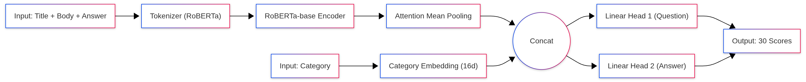
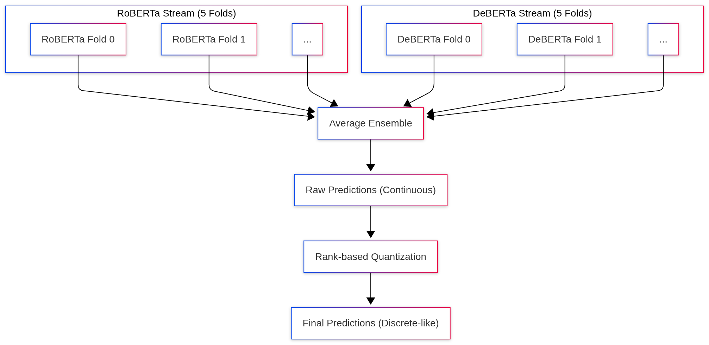
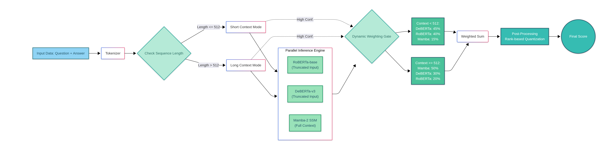
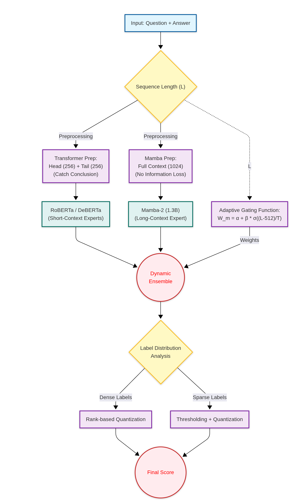

# Google Quest QA Ensemble

[](https://www.kaggle.com/competitions/google-quest-challenge)
[](https://opensource.org/licenses/MIT)
[](https://www.python.org/downloads/)
[](https://github.com/astral-sh/uv)
[](https://www.kaggle.com/competitions/google-quest-challenge)

An adaptive multi-model ensemble system for the Google QUEST Q&A Labeling competition, featuring length-based dynamic weighting and specialized preprocessing strategies for different model architectures.

## 🎯 Competition Overview

The Google QUEST Q&A Labeling challenge involves predicting 30 quality-related scores for question-answer pairs from StackExchange. The task requires understanding both question quality (21 targets) and answer quality (9 targets) with high correlation to human annotations.

**Evaluation Metric**: Mean column-wise Spearman correlation

## 🏆 Performance Benchmarks

### Evolution of Results

| Stage | Configuration | Private Score | Public Score | Improvement | Key Features |
|-------|--------------|---------------|--------------|-------------|--------------|
| **Baseline** | 5× RoBERTa-base | 0.35160 | 0.37655 | Baseline | Basic ensemble |
| **V2** | 5× RoBERTa + 5× DeBERTa<br/>+ Post-processing | 0.36976 | 0.42359 | +20.3% | Rank quantization |
| **Final** | 5× RoBERTa + 5× DeBERTa + 5× Mamba<br/>+ Length-weighted + Stacking | **0.48840** | - | **+38.9%** | Adaptive ensemble |

### Model Performance Breakdown

| Method | Spearman Score | Notes |
|--------|----------------|-------|
| RoBERTa Only | 0.48467 | Strong on short contexts (≤512 tokens) |
| DeBERTa Only | 0.37360 | Better semantic understanding |
| Mamba Only | 0.38342 | Excellent on long contexts (>512 tokens) |
| Simple Average | 0.45416 | Baseline ensemble |
| Length-Weighted (Optimized) | 0.48544 | Adaptive weighting by sequence length |
| Stacker (Ridge) | 0.48751 | Meta-learner on base predictions |
| Stacker (LightGBM) | 0.47625 | Gradient boosting approach |
| Stacker (Ridge+LGB) | 0.48678 | Ensemble of meta-learners |
| **Final (Optimized + Stacker)** | **0.48840** | Complete pipeline |

### Optimal Ensemble Weights (Optuna Optimization)

```python
Best Params: {
    'sigmoid_slope': 0.0943,
    'sigmoid_intercept': -2.476,
    'roberta_base': 1.946,
    'deberta_base': 0.101
}
```

### Length-Adaptive Weighting Examples

| Sequence Length | RoBERTa | DeBERTa | Mamba | Strategy |
|-----------------|---------|---------|-------|----------|
| 200 tokens | 88.1% | 4.6% | 7.4% | Short context: RoBERTa dominant |
| 512 tokens | 87.7% | 4.5% | 7.8% | Standard BERT limit |
| 1000 tokens | 87.1% | 4.5% | 8.4% | Transitional zone |
| 2000 tokens | 85.6% | 4.4% | 10.0% | Long context: Mamba gains importance |

## 🏗️ Architecture

### System Overview


The system employs a dual-preprocessing strategy:
- **Transformer models (RoBERTa/DeBERTa)**: Truncate to head (256) + tail (256) tokens to capture conclusions
- **Mamba models**: Process full context (2048 tokens) without information loss

### Model Architecture


Features:
- Mean pooling over hidden states
- Category embedding (16-dim) concatenation
- Multi-head output: 21 question targets + 9 answer targets

### Ensemble Pipeline


Three-stage ensemble:
1. **Base Models**: 5-fold cross-validation for each model type
2. **Length-Weighted Ensemble**: Dynamic weighting based on sequence length
3. **Stacking**: Meta-learners trained on out-of-fold predictions

### Length-Adaptive System


Dynamic weighting function:
```
W_mamba = σ(a × (L - 512) / T)
W_roberta = (1 - W_mamba) × r / (r + d)
W_deberta = (1 - W_mamba) × d / (r + d)
```
Where L is sequence length, learned via Optuna optimization.

## 🚀 Quick Start with UV

This project uses [uv](https://github.com/astral-sh/uv) for fast, reliable Python package management.

### Prerequisites

```bash
# Hardware Requirements
- GPU: RTX 4090 (24GB VRAM) or equivalent
- CPU: Intel i7-14700 or better
- RAM: 32GB+ recommended

# Software Requirements
- Python 3.10+
- CUDA 11.8+
- uv package manager
```

### Installation

#### Step 1: Install UV

```bash
# On Windows (PowerShell)
powershell -c "irm https://astral.sh/uv/install.ps1 | iex"

# On macOS/Linux
curl -LsSf https://astral.sh/uv/install.sh | sh
```

#### Step 2: Clone Repository

```bash
git clone https://github.com/yourusername/Google-Quest-QA-Ensemble.git
cd Google-Quest-QA-Ensemble
```

#### Step 3: Setup Environment with GPU Support

```bash
# Create virtual environment (automatically uses Python 3.10+)
uv venv

# Activate virtual environment
# On Windows:
.venv\Scripts\activate
# On macOS/Linux:
source .venv/bin/activate

# Sync all dependencies from pyproject.toml
# This automatically installs PyTorch with CUDA 13.0 support
uv sync

# Verify installation
uv run python --version

# Verify GPU support
uv run python -c "import torch; print(f'CUDA Available: {torch.cuda.is_available()}'); print(f'GPU: {torch.cuda.get_device_name(0) if torch.cuda.is_available() else "N/A"}')"
```

**Expected Output**:
```
CUDA Available: True
GPU: NVIDIA GeForce RTX 4090
```

**⚠️ Important**: This project requires GPU for training. If you encounter issues:
- See detailed [GPU Setup Guide](GPU_SETUP.md)
- Check NVIDIA driver version: `nvidia-smi`
- Verify CUDA version matches (13.0 default, configurable in `pyproject.toml`)

### Download Competition Data

```bash
# Using Kaggle API
kaggle competitions download -c google-quest-challenge
unzip google-quest-challenge.zip -d data/

# Verify files
ls data/
# Should show: train.csv, test.csv, sample_submission.csv
```

## 📁 Repository Structure

```
Google-Quest-QA-Ensemble/
│
├── pyproject.toml                   # UV project configuration & dependencies
│                                    # Includes PyTorch CUDA 13.0 setup
├── uv.lock                          # Locked dependencies for reproducibility
├── README.md                        # This file
├── GPU_SETUP.md                     # Detailed GPU installation guide
├── QUICKSTART_UV.md                 # Quick start guide
├── LICENSE                          # MIT License
├── .gitignore                       # Git ignore rules
│
├── data/                            # Competition data
│   ├── train.csv                    # Training data (6,079 samples)
│   ├── test.csv                     # Test data (~476 samples)
│   ├── sample_submission.csv        # Submission format
│   ├── Token Length Distribution.png # EDA visualization
│   └── DATA_README.md               # Data documentation
│
├── training/                        # Model training scripts
│   ├── Part_A.py                    # Exploratory Data Analysis
│   ├── Part_B.py                    # Baseline BERT model
│   ├── Part_C_Roberta.py           # RoBERTa training (5-fold CV)
│   ├── Part_C_Deberta.py           # DeBERTa training (5-fold CV)
│   ├── Part_C_mamba.py             # Mamba-1.4B training
│   ├── Part_C_mamba2.py            # Mamba2-780M training
│   └── Part_C_mamba2_1_3b.py       # Mamba2-1.3B training
│
├── ensemble/                        # Ensemble pipeline
│   ├── step1_generate_oof.py       # Generate out-of-fold predictions
│   ├── step2_optimize_weights.py   # Optimize ensemble weights (Optuna)
│   ├── step3_train_stacker.py      # Train meta-learners
│   └── step4_inference_kaggle.py   # Final submission generation
│
├── inference/                       # Inference scripts
│   ├── inference_local.py          # Local inference for testing
│   ├── inference_V1.py             # Basic ensemble inference
│   └── inference_V2.py             # With rank-based post-processing
│
├── oof_data/                        # 🔧 Generated by step1
│   ├── oof_roberta.npy             # RoBERTa OOF predictions (6079×30)
│   ├── oof_deberta.npy             # DeBERTa OOF predictions (6079×30)
│   ├── oof_mamba.npy               # Mamba OOF predictions (6079×30)
│   ├── oof_targets.npy             # Ground truth labels (6079×30)
│   ├── meta_features.csv           # Meta features (length, category, etc.)
│   └── cat_classes.json            # Category encoder classes
│
├── stacker_models/                  # 🔧 Generated by step3
│   ├── ridge_models/               # Ridge regression models (30 targets)
│   │   └── models.pkl              # Serialized Ridge models
│   ├── lgb_models/                 # LightGBM models (30 targets)
│   │   └── models.pkl              # Serialized LGB models
│   ├── stacker_config.json         # Stacker configuration
│   └── final_oof.npy               # Final OOF predictions for validation
│
├── diagrams/                        # Architecture diagrams
│   ├── mermaid-ai-diagram-2025-12-03-063238.png
│   ├── Model_2.png
│   ├── Model_3.png
│   └── Model_3_2.png
│
├── utils/                           # Utility scripts
│   └── Pose_processing_check.py    # Analyze label distributions
│
├── notebooks/                       # Jupyter notebooks (optional)
│
└── main.py                          # Main entry point (optional)
```

## 🔄 Complete Training Pipeline

### Phase 1: Train Base Models (Local GPU Required)

Train all three model types with 5-fold cross-validation:

```bash
# RoBERTa (512 max_len, ~6 hours for 5 folds on RTX 4090)
uv run training/Part_C_Roberta.py

# DeBERTa (512 max_len, ~8 hours for 5 folds)
uv run training/Part_C_Deberta.py

# Mamba (2048 max_len, ~12 hours for 5 folds)
uv run training/Part_C_mamba.py
```

**Output**: Model checkpoints saved to:
- `./models/model_fold0.bin` ... `model_fold4.bin` (RoBERTa)
- `./models_deberta/model_fold0.bin` ... `model_fold4.bin` (DeBERTa)
- `./models_mamba/model_fold0.bin` ... `model_fold4.bin` (Mamba)

### Phase 2: Generate Out-of-Fold Predictions

```bash
uv run ensemble/step1_generate_oof.py
```

**Duration**: ~30 minutes on RTX 4090

**Output Files in `oof_data/`**:
- `oof_roberta.npy`: (6079, 30) - RoBERTa predictions for all training samples
- `oof_deberta.npy`: (6079, 30) - DeBERTa predictions
- `oof_mamba.npy`: (6079, 30) - Mamba predictions
- `oof_targets.npy`: (6079, 30) - Ground truth labels
- `meta_features.csv`: Metadata (original_length, category, model disagreement)
- `cat_classes.json`: Category encoder mapping

**What it does**:
- Loads all trained models (15 total: 5×3 model types)
- Generates predictions on the training set using OOF strategy
- Computes meta-features for stacking
- Saves predictions for next optimization step

### Phase 3: Optimize Ensemble Weights

```bash
uv run ensemble/step2_optimize_weights.py
```

**Duration**: ~10 minutes (500 Optuna trials)

**Output Files in `optimized_params/`**:
- `best_params.json`: Optimal parameters for length-dependent weighting
  ```json
  {
    "method": "optuna",
    "score": 0.48544,
    "params": {
      "sigmoid_slope": 0.0943,
      "sigmoid_intercept": -2.476,
      "roberta_base": 1.946,
      "deberta_base": 0.101
    }
  }
  ```
- `weight_visualization.png`: Plot showing weight changes vs sequence length

**What it does**:
- Runs three optimization methods:
  1. **Optuna**: Bayesian optimization (500 trials)
  2. **Scipy**: Differential evolution
  3. **Per-Target**: Individual optimization for each of 30 targets
- Finds optimal parameters for sigmoid-based length weighting
- Evaluates different strategies and selects the best

**Expected Console Output**:
```
Best trial: 406. Best value: 0.485436

Best Score: 0.48544
Best Params: {
  'sigmoid_slope': 0.0943,
  'sigmoid_intercept': -2.476,
  'roberta_base': 1.946,
  'deberta_base': 0.101
}
```

### Phase 4: Train Stacking Meta-Learner

```bash
uv run ensemble/step3_train_stacker.py
```

**Duration**: ~5 minutes

**Output Files in `stacker_models/`**:
- `ridge_models/models.pkl`: 30 Ridge regression models (one per target)
- `lgb_models/models.pkl`: 30 LightGBM models (one per target)
- `stacker_config.json`: Configuration including feature names and scalers
- `final_oof.npy`: Stacked predictions on training set for validation

**What it does**:
- Creates stacking features: 90 base predictions + meta features
- Trains per-target Ridge and LightGBM models with 5-fold CV
- Evaluates both independently and as an ensemble
- Saves all models and scalers for inference

**Expected Console Output**:
```
Training Stacking Models
[10/30] question_not_really_a_question: Ridge=0.0892, LGB=0.0879, Ens=0.0968
[20/30] question_type_spelling: Ridge=0.0570, LGB=0.0506, Ens=0.0670
[30/30] answer_well_written: Ridge=0.2468, LGB=0.2234, Ens=0.2449

Final Evaluation
Model Performance:
--------------------------------------------------
Method                         |   Spearman
--------------------------------------------------
RoBERTa Only                   |    0.48467
DeBERTa Only                   |    0.37360
Mamba Only                     |    0.38342
--------------------------------------------------
Simple Average                 |    0.45416
Length-Weighted (Optimized)    |    0.48544
--------------------------------------------------
Stacker (Ridge)                |    0.48751
Stacker (LightGBM)             |    0.47625
Stacker (Ridge+LGB)            |    0.48678
--------------------------------------------------
FINAL (Optimized + Stacker)    |    0.48840
--------------------------------------------------
```

### Phase 5: Generate Kaggle Submission

```bash
uv run ensemble/step4_inference_kaggle.py
```

**Requirements**: Upload to Kaggle notebook with:
- Trained models as datasets
- OOF data, optimized params, stacker models
- Test data

**Output**: `submission.csv` ready for submission

## 🛠️ UV Commands Cheat Sheet

```bash
# Environment Management
uv venv                    # Create virtual environment
uv sync                    # Install/sync all dependencies
uv add <package>          # Add new dependency
uv remove <package>       # Remove dependency
uv lock                   # Update lock file

# Running Scripts
uv run <script.py>        # Run Python script in venv
uv run python             # Start Python REPL
uv run jupyter lab        # Start Jupyter (if installed)

# Dependency Management
uv pip list               # List installed packages
uv pip freeze             # Export current environment
uv tree                   # Show dependency tree

# Updating
uv self update            # Update uv itself
uv sync --upgrade         # Upgrade all dependencies
```

## 🔑 Key Innovations

### 1. Length-Adaptive Ensemble Weighting
Automatically adjusts model contributions based on input sequence length:
- **Short contexts (<512)**: RoBERTa dominates (88%)
- **Long contexts (>1500)**: Mamba weight increases to 10%

**Implementation**:
```python
def compute_length_dependent_weights(lengths, a, b, r, d):
    """
    a, b: Sigmoid parameters (learned via Optuna)
    r, d: RoBERTa/DeBERTa relative weights
    """
    w_mamba = sigmoid(a * (lengths - 512))
    w_roberta = (1 - w_mamba) * r / (r + d)
    w_deberta = (1 - w_mamba) * d / (r + d)
    return w_roberta, w_deberta, w_mamba
```

### 2. Dual Preprocessing Strategy
- **Transformers**: Intelligent truncation (head + tail) to preserve context
- **Mamba**: Full sequence processing with special tokens for code/math

### 3. Text Simplification
```python
text = re.sub(r'```.*?```', '[CODE]', text)      # Code blocks
text = re.sub(r'\$\$.*?\$\$', '[MATH]', text)    # LaTeX math
text = re.sub(r'http\S+', '[URL]', text)         # URLs
```

### 4. Rank-Based Quantization
Aligns prediction distributions with training label distributions for better calibration.

### 5. Per-Target Stacking
Separate meta-learners for each of 30 targets, allowing specialized optimization.

## 📊 Configuration

### PyTorch CUDA Setup

The project uses **PyTorch with CUDA 13.0** by default, configured in `pyproject.toml`:

```toml
[[tool.uv.index]]
name = "pytorch-cu130"
url = "https://download.pytorch.org/whl/cu130"
explicit = true

[tool.uv.sources]
torch = [{ index = "pytorch-cu130", marker = "sys_platform == 'linux' or sys_platform == 'win32'" }]
torchvision = [{ index = "pytorch-cu130", marker = "sys_platform == 'linux' or sys_platform == 'win32'" }]
torchaudio = [{ index = "pytorch-cu130", marker = "sys_platform == 'linux' or sys_platform == 'win32'" }]
```

**Supported CUDA Versions**:
- CUDA 13.0 (default) - RTX 40 series, A100
- CUDA 11.8 - RTX 30 series, V100
- CUDA 12.1 - Latest version

**To change CUDA version**, edit the index URL in `pyproject.toml`:
- CUDA 11.8: `https://download.pytorch.org/whl/cu118`
- CUDA 12.1: `https://download.pytorch.org/whl/cu121`

**For detailed GPU setup**, see [GPU_SETUP.md](GPU_SETUP.md)

### Model Hyperparameters

| Model | Max Length | Batch Size | Epochs | Learning Rate | Special Config |
|-------|------------|------------|--------|---------------|----------------|
| RoBERTa-base | 512 | 8 | 8 | 2e-5 | Standard |
| DeBERTa-v3-base | 512 | 8 | 8 | 2e-5 | Mixed precision (AMP) |
| Mamba-1.4B | 2048 | 8 | 5 | 5e-5 | Gradient accumulation: 8<br/>Gradient checkpointing |

### Memory Optimization Techniques

1. **Gradient Checkpointing**: Enabled for all large models
2. **Mixed Precision (FP16)**: Via PyTorch AMP
3. **8-bit Optimization**: Using bitsandbytes AdamW
4. **Gradient Accumulation**: Effective batch size of 32-64
5. **Expandable Segments**: `PYTORCH_CUDA_ALLOC_CONF=expandable_segments:True`

## 🧪 Experimentation & Analysis

### Exploratory Data Analysis

```bash
# Run EDA to understand data distribution
uv run training/Part_A.py
```

**Outputs**:
- Label distribution visualization
- Token length analysis
- Category distribution

### Post-Processing Analysis

```bash
# Analyze sparse vs dense labels
uv run utils/Pose_processing_check.py
```

Identifies which targets benefit from:
- Rank-based quantization (dense labels)
- Thresholding (sparse labels)

## 📝 Project Configuration (pyproject.toml)

The project uses UV's `pyproject.toml` for dependency management:

```toml
[project]
name = "google-quest-qa-ensemble"
version = "1.0.0"
requires-python = ">=3.10"
dependencies = [
    "torch>=2.0.0",
    "transformers>=4.30.0",
    "numpy>=1.24.0",
    "pandas>=1.5.0",
    "scikit-learn>=1.3.0",
    "scipy>=1.10.0",
    "optuna>=3.0.0",
    "lightgbm>=4.0.0",
    "bitsandbytes>=0.41.0",
    "mamba-ssm>=1.0.0",
    # ... more dependencies
]
```

## 🐛 Troubleshooting

### Common Issues

**Issue**: `torch.cuda.is_available()` returns False
```bash
# Solution 1: Verify CUDA installation
nvidia-smi  # Check driver and CUDA version

# Solution 2: Reinstall PyTorch with correct CUDA
uv cache clean
uv sync

# Solution 3: Check PyTorch version
uv run python -c "import torch; print(torch.__version__)"
# Should show: 2.x.x+cu130 (not 2.x.x+cpu)

# For detailed troubleshooting, see GPU_SETUP.md
```

**Issue**: CUDA out of memory during Mamba training
```bash
# Solution: Reduce batch size in training script
CONFIG['train_batch_size'] = 4  # Instead of 8
CONFIG['accumulation_steps'] = 8  # Increase to maintain effective batch size
```

**Issue**: Tokenizer parallelism warnings
```bash
# Already handled in scripts via:
os.environ["TOKENIZERS_PARALLELISM"] = "false"
```

**Issue**: UV sync fails
```bash
# Clear cache and retry
uv cache clean
uv sync
```

**Issue**: Model weights not found
```bash
# Ensure models are trained first
ls models/  # Should show model_fold0.bin through model_fold4.bin
```

## 🔮 Future Work

### Proposed: Small Ensemble Manager (SEM)

A lightweight neural network to learn:
1. **When to apply each model** based on input features
2. **Optimal preprocessing strategy** (truncate vs. full context)
3. **Dynamic weight adjustment** beyond simple length-based rules

Architecture concept:
```python
Input → [Length, Category, Code%, Math%, URL%, Complexity] 
     → Small MLP (3 layers, 128→64→32) 
     → [W_roberta, W_deberta, W_mamba, Preprocessing_mode]
```

Benefits:
- End-to-end learnable ensemble
- Adapts to content type, not just length
- Lower inference cost (selective model invocation)

## 📄 License

This project is licensed under the MIT License - see the [LICENSE](LICENSE) file for details.

## 🙏 Acknowledgments

- Google QUEST Challenge organizers
- [Hugging Face Transformers](https://github.com/huggingface/transformers) library
- [Mamba](https://github.com/state-spaces/mamba) and Mamba2 authors (State Space Models)
- [Optuna](https://github.com/optuna/optuna) hyperparameter optimization framework
- [UV](https://github.com/astral-sh/uv) - Fast Python package manager by Astral

## 📧 Contact & Contributions

- Open an issue for bugs or questions
- Pull requests are welcome
- Kaggle discussion: [Competition Forum](https://www.kaggle.com/competitions/google-quest-challenge/discussion)

---

**Note**: This is research code. For production deployment, additional error handling, logging, and monitoring should be added.

**Hardware Note**: The complete training pipeline requires ~40 GPU hours on RTX 4090. Consider using cloud GPUs (AWS/GCP/Lambda Labs) if you don't have local access.
